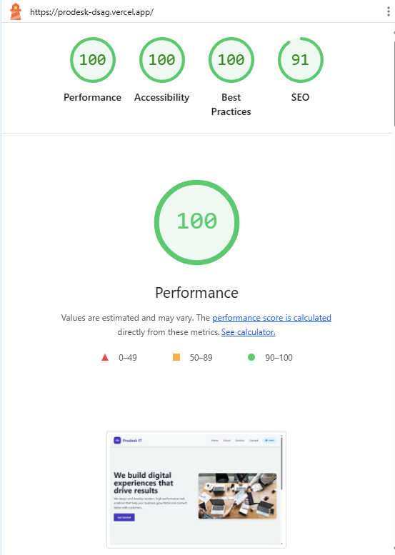
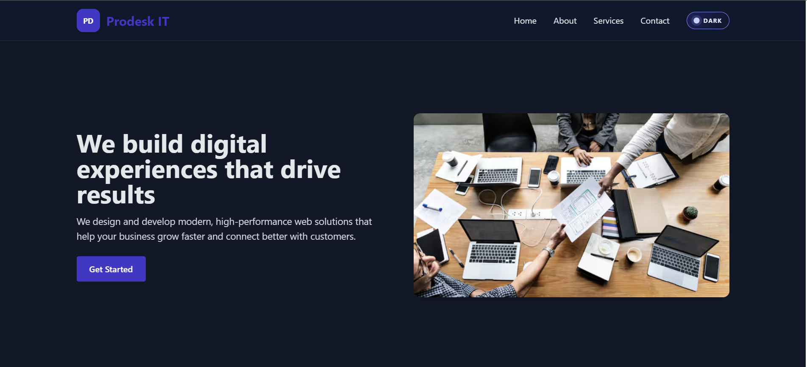

# Mission 1 - Prodesk Landing Page

This mission contains a responsive landing page built with HTML and Tailwind CSS.

## What Is Included

- Frosted glass navbar using `backdrop-filter`
- Light and dark mode toggle with saved preference
- Hero section with left content and right image
- Services section with hover-lift cards
- Neat multi-column footer with links and social buttons

## Project Files

- `index.html` - Main page
- `prompt.md` - Prompt notes/tasks
- `outputs/` - Output preview images

## How To Run

1. Open `index.html` in your browser.
2. Click the theme button to test light and dark modes.
3. Hover over service cards to see lift animation.

## Output Images

### Live Image Preview

### Performance Report

## Live Link

[https://prodesk-dsag.vercel.app/](https://prodesk-dsag.vercel.app/)
